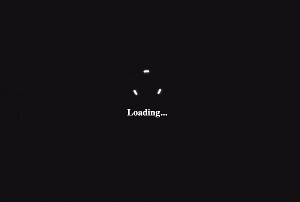

<div dir="rtl">

<div style="text-align: center;">


# block-ui.js

<p>
<a href="https://github.com/vzool/block-ui.js/blob/main/README.md"></a>
<a href="https://npmjs.org/package/block-ui.js" title="View this project on NPM"></a>
</p>
</div>


مكون إضافي بسيط مكون من 39 سطر برمجي فقط، ولكنه قوي مبرمج بلغة الجافا سكريبت (Javascript) خالص وذلك لعرض صفحة انتظار تمنع المستخدم من التفاعل مع الصفحة بالكامل أو جزء منها أثناء تنفيذ عملية أو عدت عمليات في الخلفية.


يمكنك تغيير كل شيء، بدءًا من ملف `gif` المحمل ولون الخلفية ولون النص والرسالة، هذا ينطبق على كل أو جزء من الصفحة.
لذلك، يمكنك استخدامه في أي مشروع، حتى لو كانت صفحة `HTML` ثابتة بسيطة.

###### الأمثلة (Examples) https://vzool.github.io/block-ui.js

<div dir="rtl">

## التثبيت (Installation)

### مدير حزم مكتبات NPM الخاصة بـ Node.js

```bash
npm install block-ui.js
```

### مدير حزم مكتبات Yarn الخاص بـ Node.js

```bash
yarn add block-ui.js
```

### شبكة توصيل المحتوى (Content Delivery Network - CDN)

```html
<script src="https://unpkg.com/block-ui.js"></script>
```

## الاستخدام (Usage)

### الدمج البرمجي (Import)

</div>

```javascript
import 'block-ui.js';
```
<div dir="rtl">

### التهيئة (Initialize)

```javascript
document.vzool_blockui_image = 'https://i.imgur.com/3g7OaQx.gif'; // or local file like loader.gif
document.vzool_blockui_background = '#121111'; // optional
document.vzool_blockui_color = '#ffffff'; // optional
```

### حجب الصفحة (Block UI)

يجب أن يكون هناك عنصر بمعرف `id` في الصفحة لحظره باستخدام مُحمل gif ولون الخلفية المحدد في `document.vzool_blockui_background` و `document.vzool_blockui_color` المتغيرات أعلاه.

```javascript
BlockUI("container").show(); // not #container
```

### حالة حجب الصفحة (Block UI Status)

```javascript
BlockUI("container").blocked(); // true or false
```

### تحديث رسائل حجب الصفحة (Update Messages)


```javascript
BlockUI("container").message("<h1 style='padding-top: 190px;'>Loading...</h1>"); // set message
BlockUI("container").message(); // clear the message
```

يمكنك استخدام `padding-top` أو `padding-bottom` لتحريك الرسالة لأعلى أو لأسفل وفقًا لذلك ، لذا فهي محتوى `HTML` ، ويمكنك التحديث بأي شيء صالح لـ `HTML`.

* ملاحظة: يجب تهيئته باستدعاء `show()` أولاً ، وإلا فلن يعمل وسيُعيد فقط `false`.

### إزالة حجب الصفحة (Unblock UI)

</div>

```javascript
BlockUI("container").hide();
```

<div dir="rtl">

### الوثائق البرمجية (API Documentation)
</div>

الاسم (Name) | النوع (Type) | الخيارات (Parameter) | الافتراضي (Default) | الوصف (Description)
--- | --- | --- | --- | ---
`BlockUI()` | الباني (constructor) | `id` | - | يقوم بإنشاء مقترح (instance) من الكائن
`show()` | طريقة مقترحة (method) | - | - | تعرض واجهة حجب الصفحة
`hide()` | طريقة مقترحة (method) | - | - | تخفي واجهة حجب الصفحة
`blocked()` | طريقة مقترحة (method) | - | - | تحقق من حالة حجب الصفحة
`message()` | طريقة مقترحة (method) | `message` | - | تحديث رسائل حجب الصفحة
`document.vzool_blockui_image` | متغير (variable) | - | `loader.gif` | تحديد ملف `gif` للمحمل
`document.vzool_blockui_background` | متغير (variable) | - | `#121111` | تحديد لون الخلفية
`document.vzool_blockui_color` | متغير (variable) | - | `#ffffff` | تحديد لون النص

للمزيد من المعلومات، يرجى قراءة البرمجة المصدرية (source code).

<div dir="rtl">

### المراجع (References)

- https://onezeronull.com/2013/03/25/simple-element-blocker-with-and-without-jquery
- https://www.pinterest.com/pin/224828206383260450
- https://www.iconfinder.com/icons/8674984/ic_fluent_eye_tracking_off_regular_icon
- https://smashinghub.com/10-cool-loading-animated-gif.htm

### الترخيص (License)

ISC License

</div>