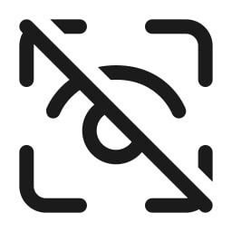

<div style="text-align: center;">


# block-ui.js

<p>
<a href="https://github.com/vzool/block-ui.js/blob/main/README.ar.md"></a>
<a href="https://npmjs.org/package/block-ui.js" title="View this project on NPM"></a>
</p>
</div>

A simple 39 line of code, yet powerful plug-in written in pure Javascript to display a waiting page that prevents the user from interacting with all or part of the page while a background process or processes are executing.


You can change everything, started with the loader `gif`, background color, text color and the message.
This applies to all or part of a page.
So, you can use it in any project, even if it's a simple static html page.

###### Examples https://vzool.github.io/block-ui.js

## Installation

### NPM

```bash
npm install block-ui.js
```

### Yarn

```bash
yarn add block-ui.js
```

### CDN

```html
<script src="https://unpkg.com/block-ui.js"></script>
```

## Usage

### Import

```javascript
import 'block-ui.js';
```

### Initialize

```javascript
document.vzool_blockui_image = 'https://i.imgur.com/3g7OaQx.gif'; // or local file like loader.gif
document.vzool_blockui_background = '#121111'; // optional
document.vzool_blockui_color = '#ffffff'; // optional
```

### Block UI

There should be an element with `id` identifier in the page to block it with loader gif and background color set in `document.vzool_blockui_background` and `document.vzool_blockui_color` variables above.

```javascript
BlockUI("container").show(); // not #container
```

### Block UI Status

```javascript
BlockUI("container").blocked(); // true or false
```

### Update Messages


```javascript
BlockUI("container").message("<h1 style='padding-top: 190px;'>Loading...</h1>"); // set message
BlockUI("container").message(); // clear the message
```

You can use `padding-top` or `padding-bottom` to move the message up or down accordingly, so it is `HTML` content, you can update with anything which is `HTML` valid.

* Note: it should be initialized with calling `show()` method first, otherwise it will not work and just return `false`.

### Unblock UI

```javascript
BlockUI("container").hide();
```

### API Documentation

Name | Type | Parameter | Default | Description
--- | --- | --- | --- | ---
`BlockUI()` | constructor | `id` | - | Create a new instance
`show()` | method | - | - | Show the block UI
`hide()` | method | - | - | Hide the block UI
`blocked()` | method | - | - | Check if the block UI is shown
`message()` | method | `message` | - | Set or clear the message
`document.vzool_blockui_image` | variable | - | `loader.gif` | Set or clear the image
`document.vzool_blockui_background` | variable | - | `#121111` | Set or clear the background
`document.vzool_blockui_color` | variable | - | `#ffffff` | Set or clear the color

For more information, please read the source code.

### References

- https://onezeronull.com/2013/03/25/simple-element-blocker-with-and-without-jquery
- https://www.pinterest.com/pin/224828206383260450
- https://www.iconfinder.com/icons/8674984/ic_fluent_eye_tracking_off_regular_icon
- https://smashinghub.com/10-cool-loading-animated-gif.htm

### License

ISC License